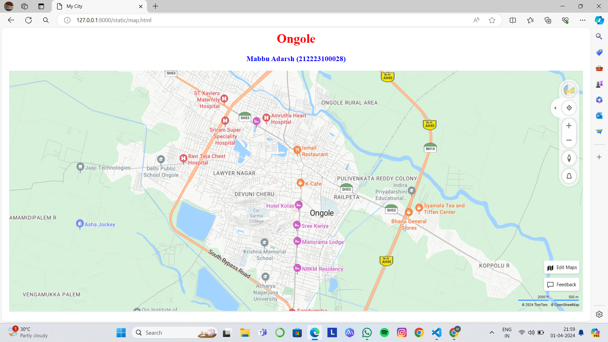
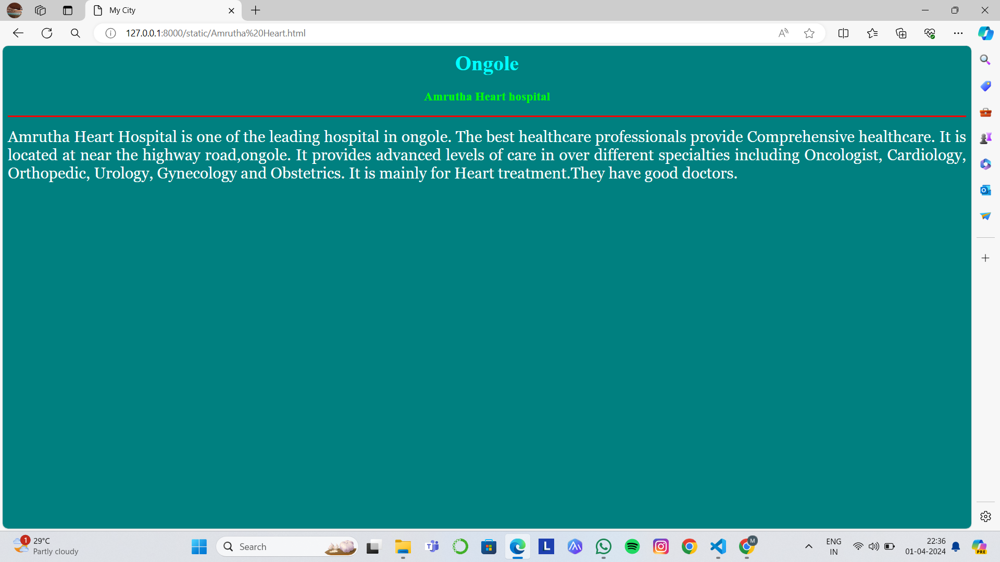
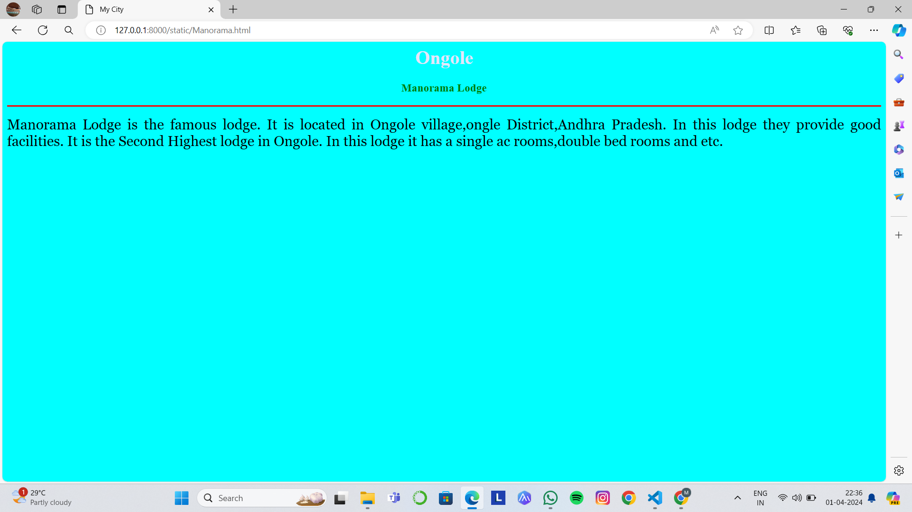
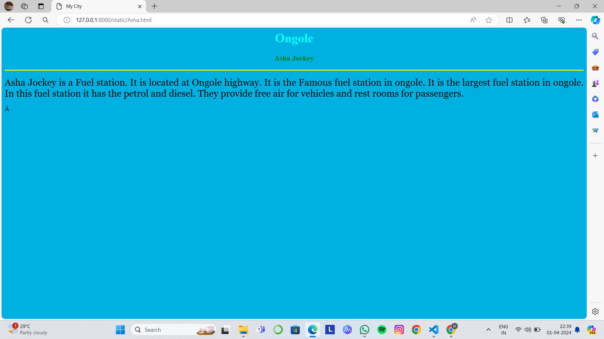
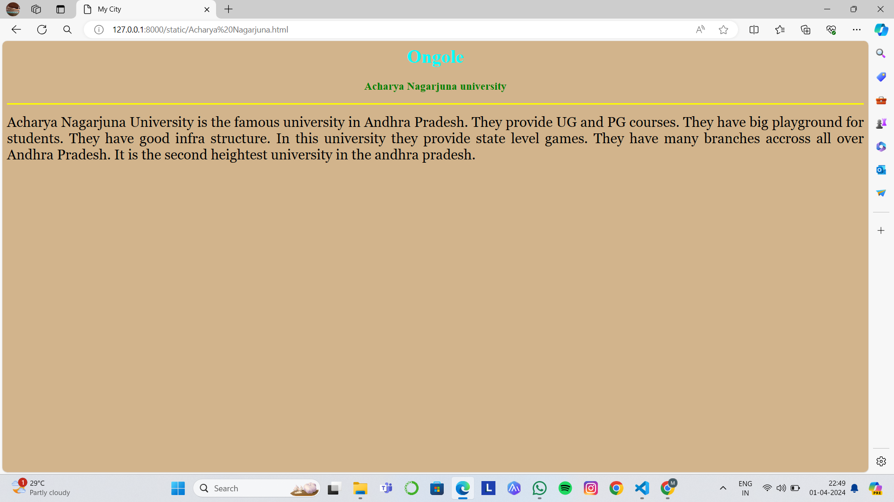
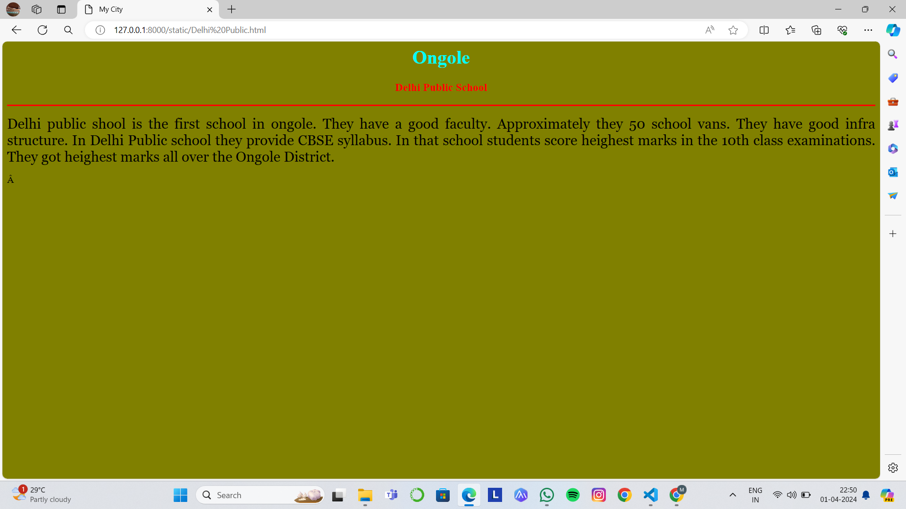

# Ex04 Places Around Me
## Date:  01.04.2024

## AIM
To develop a website to display details about the places around my house.

## DESIGN STEPS

### STEP 1
Create a Django admin interface.

### STEP 2
Download your city map from Google.

### STEP 3
Using ```<map>``` tag name the map.

### STEP 4
Create clickable regions in the image using ```<area>``` tag.

### STEP 5
Write HTML programs for all the regions identified.

### STEP 6
Execute the programs and publish them.

## CODE
```
map.html 

<html>
    <head>
        <title>My City</title>
    </head>
    <body>
        <h1 align="center">
            <font color="red"><b>Ongole</b></font>
        </h1>
        <h3 align="center">
            <font color="blue"><b>Mabbu Adarsh (212223100028)</b></font>
        </h3>
        <center>
            
            <map name="MyCity">
                <area target="" alt="School" title="School" href="Delhi Public.html" coords="698,365,913,496" shape="rect">
                <area target="" alt="university" title="university" href="Acharya Nagarjuna.html" coords="250,360,220,100" shape="circle">
                <area target="" alt="Jockey" title="Jockey" href="Asha.html" coords="700,250,600,300" shape="rect">
                <area target="" alt="Hospital" title="Hospital" href="Amrutha Heart.html" coords="580,300,50,50" shape="circle">
                <area target="" alt="Lodge" title="Lodge" href="Manorama.html" coords="60,60,150,150" shape="rect">
                <area target="" alt="" title="" href="" coords="" shape="0">
            </map>
        </center>  
    </body>
</html>


Manorama.html

<html>
    <head>
        <title>My City</title>
    </head>
    <body bgcolor="cyan">
        <h1 align="center">
            <font color="lavender"><b>Ongole</b></font>
        </h1>
        <h3 align="center">
            <font color="green"><b>Manorama Lodge</b></font>
        </h3>
        <hr size="3" color="red">
        <p align="justify">
            <font face="Georgia" size="5" color="black">
                Manorama Lodge is the famous lodge.
                It is located in Ongole village,ongle District,Andhra Pradesh.
                In this lodge they provide good facilities.
                It is the Second Highest lodge in Ongole.
                In this lodge it has a single ac rooms,double bed rooms and etc.
            </font>
        </p>
    </body>
</html>


Amrutha Heart.html

<html>
    <head>
        <title>My City</title>
    </head>
    <body bgcolor="teal">
        <h1 align="center">
            <font color="cyan"><b>Ongole</b></font>
        </h1>
        <h3 align="center">
            <font color="lime"><b>Amrutha Heart hospital</b></font>
        </h3>
        <hr size="3" color="red">
        <p align="justify">
            <font face="Georgia" size="5" color="white">
                Amrutha Heart Hospital is one of the leading hospital in ongole. 
                The best healthcare professionals provide Comprehensive healthcare. 
                It is located at near the highway road,ongole. 
                It provides advanced levels of care in over different specialties including Oncologist, Cardiology, Orthopedic, Urology, Gynecology and Obstetrics.
                It is mainly for Heart treatment.They have good doctors.
            </font>
        </p>
    </body>
</html>


Asha.html

<html>
    <head>
        <title>My City</title>
    </head>
    <body bgcolor="sky blue">
        <h1 align="center">
            <font color="cyan"><b>Ongole</b></font>
        </h1>
        <h3 align="center">
            <font color="green"><b>Asha Jockey</b></font>
        </h3>
        <hr size="3" color="yellow">
        <p align="justify">
            <font face="Georgia" size="5" color="black">
                Asha Jockey is a Fuel station.
                It is located at Ongole highway.
                It is the Famous fuel station in ongole.
                It is the largest fuel station in ongole.
                In this fuel station it has the petrol and diesel.
                They provide free air for vehicles and rest rooms for passengers.
            </font>
        </p>
    </body>
</html>


Acharya Nagarjuna.html

<html>
    <head>
        <title>My City</title>
    </head>
    <body bgcolor="tan">
        <h1 align="center">
            <font color="cyan"><b>Ongole</b></font>
        </h1>
        <h3 align="center">
            <font color="green"><b>Acharya Nagarjuna university</b></font>
        </h3>
        <hr size="3" color="yellow">
        <p align="justify">
            <font face="Georgia" size="5" color="black">
                Acharya Nagarjuna University is the famous university in Andhra Pradesh.
                They provide UG and PG courses.
                They have big playground for students.
                They have good infra structure.
                In this university they provide state level games.
                They have many branches accross all over Andhra Pradesh.
                It is the second heightest university in the andhra pradesh.
            </font>
        </p>
    </body>
</html>


Delhi Public.html

<html>
    <head>
        <title>My City</title>
    </head>
    <body bgcolor="olive">
        <h1 align="center">
            <font color="cyan"><b>Ongole</b></font>
        </h1>
        <h3 align="center">
            <font color="red"><b>Delhi Public School</b></font>
        </h3>
        <hr size="3" color="red">
        <p align="justify">
            <font face="Georgia" size="5" color="black">
                Delhi public shool is the first school in ongole.
                They have a good faculty.
                Approximately they 50 school vans.
                They have good infra structure.
                In Delhi Public school they provide CBSE syllabus.
                In that school students score heighest marks in the 10th class examinations.
                They got heighest marks all over the Ongole District.
            </font>
        </p>
    </body>
</html>


```


## OUTPUT








## RESULT
The program for implementing image maps using HTML is executed successfully.
